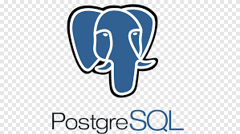
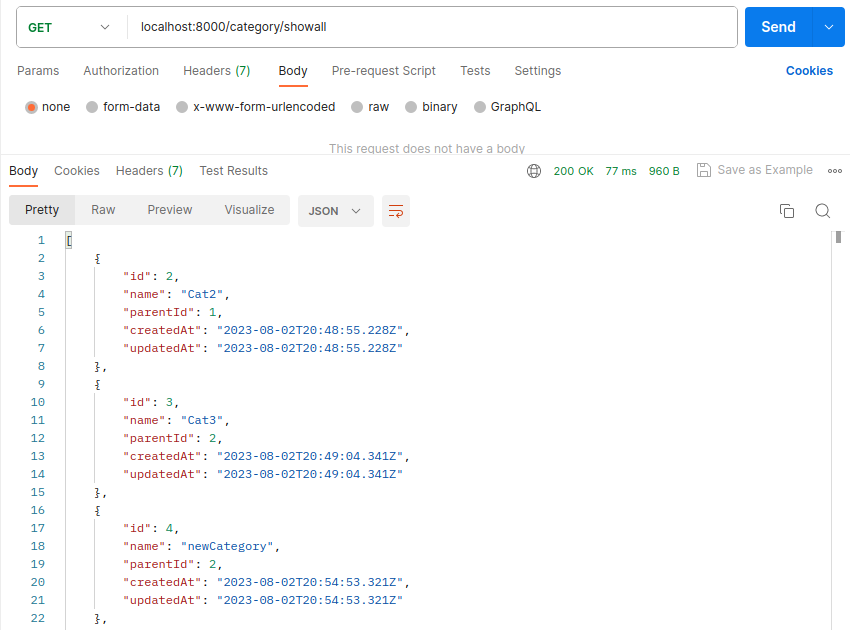
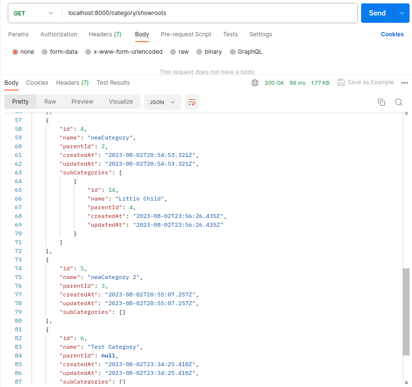
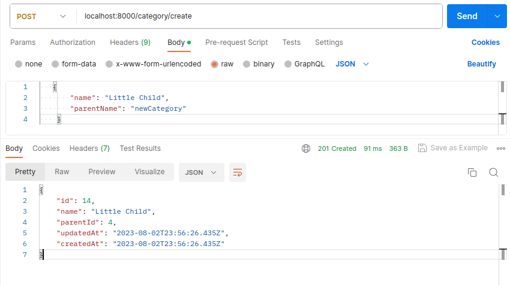
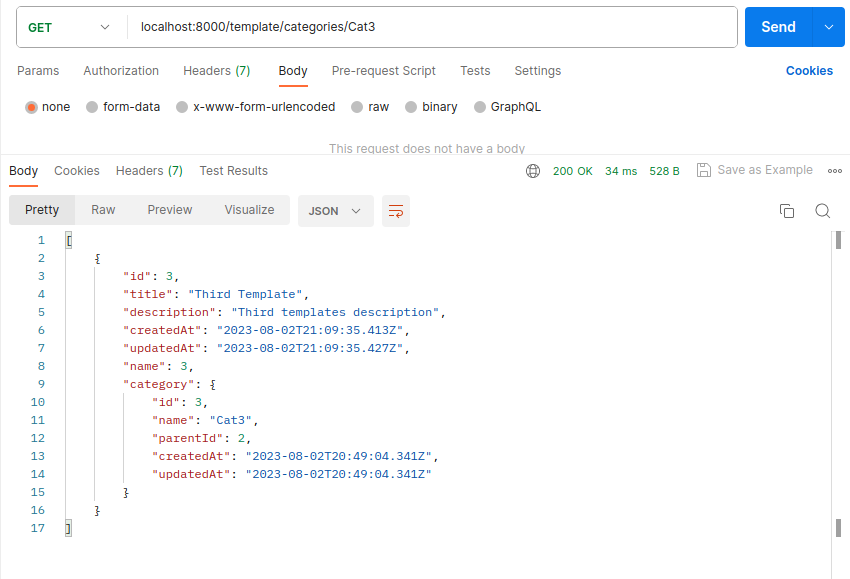
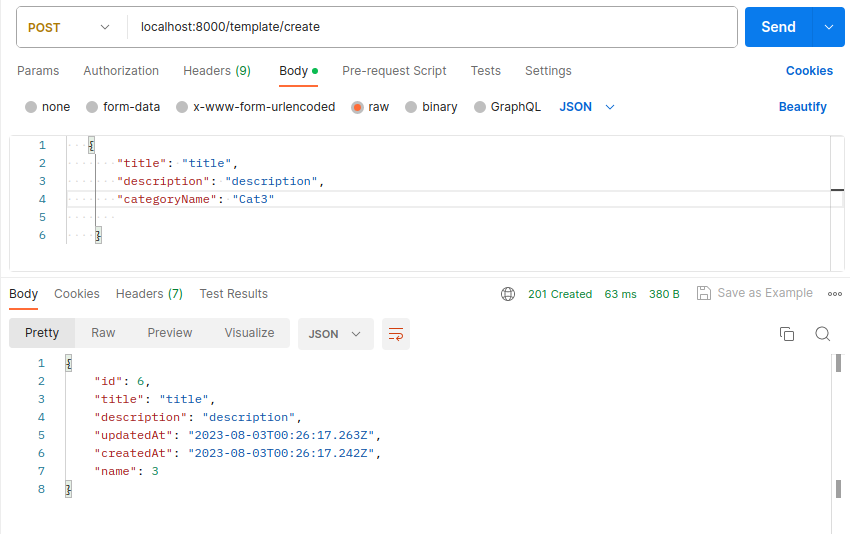
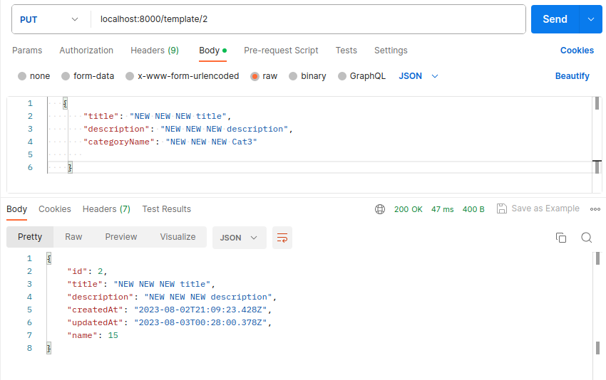
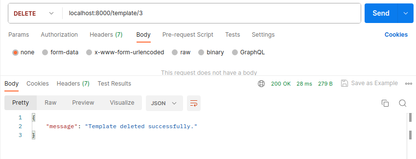

# Template Handler Documentation

Welcome to the documentation for the Template Handler project. This guide will walk you through the installation process, usage instructions, API endpoints, database structure, and more.

## Table of Contents

1. [Introduction](#introduction)
2. [Installation](#installation)
   - [Clone the Repository](#clone-the-repository)
   - [Install Dependencies](#install-dependencies)
   - [Database Configuration](#database-configuration)
   - [Start the Server](#start-the-server)
3. [Usage](#usage)
   - [API Endpoints](#api-endpoints)
4. [Database](#database)
   - [Categories](#categories)
   - [Templates](#templates)
5. [Contributing](#contributing)
6. [License](#license)

## Introduction

The Template Handler is a Node.js application designed to manage templates. It offers functionalities to create, edit, delete, and retrieve templates associated with different categories. This documentation will guide you through the installation process and provide information about how to use the application effectively.

## Installation

Follow these steps to set up the Template Handler on your local machine.

### Clone the Repository

```bash
git clone https://github.com/MostafaMoradi7/TemplateHandler.git
```

### Install Dependencies

Navigate to the project directory and install the required dependencies.

```bash
cd TemplateHandler
npm install
```

Certainly! Here's an updated version of the "Database" section in your project documentation with the addition of the PostgreSQL database image and instructions for using other relational databases:

---

## Database

The application uses a relational database to store categories and templates. You can choose to use PostgreSQL or any other relational database of your preference. Below, we provide instructions for setting up the PostgreSQL database, along with guidance for using other relational databases.

### PostgreSQL Database



**Installation and Configuration**

1. Install PostgreSQL on your system.
2. Configure the database connection in `conf/database.js` by providing the necessary credentials and details.

   ```javascript
   // conf/database.js
   const { Sequelize } = require('sequelize');

   const connection = new Sequelize({
     dialect: 'postgres',
     host: 'localhost',
     port: 5432,
     database: 'database',
     username: 'username',
     password: 'password',
   });

   module.exports = connection;
   ```

3. Ensure you have the required dependencies installed by running:

   ```bash
   npm install pg sequelize
   ```

### Other Relational Databases

If you prefer to use a different relational database, such as MySQL or SQLite, you can do so. Here's how you can set it up:

1. Install the appropriate database system on your system.
2. Configure the database connection in `conf/database.js` by providing the necessary credentials and details specific to your chosen database system.

   ```javascript
   // conf/database.js
   const { Sequelize } = require('sequelize');

   const connection = new Sequelize({
     dialect: 'mysql', // Change this to 'mysql', 'sqlite', etc. as needed
     host: 'localhost',
     port: 3306, // Change the port if needed
     database: 'database',
     username: 'username',
     password: 'password',
   });

   module.exports = connection;
   ```

3. Install the appropriate dependencies for your chosen database:

   - For MySQL:

     ```bash
     npm install mysql2 sequelize
     ```

   - For SQLite:

     ```bash
     npm install sqlite3 sequelize
     ```

### Migrating and Seeding

After setting up the database connection, you can use Sequelize migrations and seeders to create and populate the database schema. Refer to the Sequelize documentation for more information on how to create migrations and seeders.

## Contributing

Contributions are welcome! If you encounter any issues or have suggestions for improvements related to the database configuration or usage, please feel free to open an issue or submit a pull request.

---

Please note that you should replace `'mysql'`, `'mysql2'`, `'sqlite3'`, and any other specific references with the appropriate database dialects based on your chosen database. Additionally.

### Start the Server

Launch the server by running the following command:

```bash
npm start
```

The server will start, and you'll see a message indicating that it's running at a specific port (default is 8000).

Certainly! Here's an example of how you can add screenshots and descriptions for each endpoint using Markdown in your project documentation:

---

## Usage

The Template Handler provides a RESTful API for managing categories and templates. You can interact with the API using HTTP requests. Below, we provide screenshots and descriptions for each endpoint using Postman.

### Categories

#### `GET /category/showall`

Retrieve all categories.

<details>
<summary>Postman Screenshot</summary>



</details>

Description: This endpoint returns a list of all categories available in the database.

#### `GET /category/showroots`

Retrieve categories with their sub-categories.

<details>
<summary>Postman Screenshot</summary>



</details>

Description: This endpoint returns a hierarchical view of categories, including their sub-categories.

#### `PUT /category/edit/:name`

Edit a category.

<details>
<summary>Postman Screenshot</summary>


</details>

Description: Use this endpoint to edit the properties of an existing category. Provide the category name in the URL and the updated information in the request body.

#### `POST /category/create`

Create a new category.

<details>
<summary>Postman Screenshot</summary>



</details>

Description: Use this endpoint to create a new category. Provide the category name in the request body. Optionally, you can provide the `parentName` to specify a parent category.

### Templates

#### `GET /template/categories/:categoryName`

Retrieve templates by category.

<details>
<summary>Postman Screenshot</summary>



</details>

Description: This endpoint returns a list of templates associated with the specified category name.

#### `GET /template/showall`

Retrieve all templates.

<details>
<summary>Postman Screenshot</summary>


</details>

Description: This endpoint returns a list of all templates available in the database.

#### `POST /template/create`

Create a new template.

<details>
<summary>Postman Screenshot</summary>



</details>

Description: Use this endpoint to create a new template. Provide the template title, description, and the associated category name in the request body.

#### `PUT /template/:id`

Edit a template.

<details>
<summary>Postman Screenshot</summary>



</details>

Description: Use this endpoint to edit the properties of an existing template. Provide the template ID in the URL and the updated information in the request body.

#### `DELETE /template/:id`

Delete a template.

<details>
<summary>Postman Screenshot</summary>



</details>

Description: Use this endpoint to delete a template by providing its ID in the URL.

---

## Database

The application uses a PostgreSQL database to store categories and templates. The database connection configuration can be found in `conf/database.js`.

### Categories

Categories are organized hierarchically, with each category having a unique name and an optional parent category.

### Templates

Templates have a title, description, and are associated with a category.
